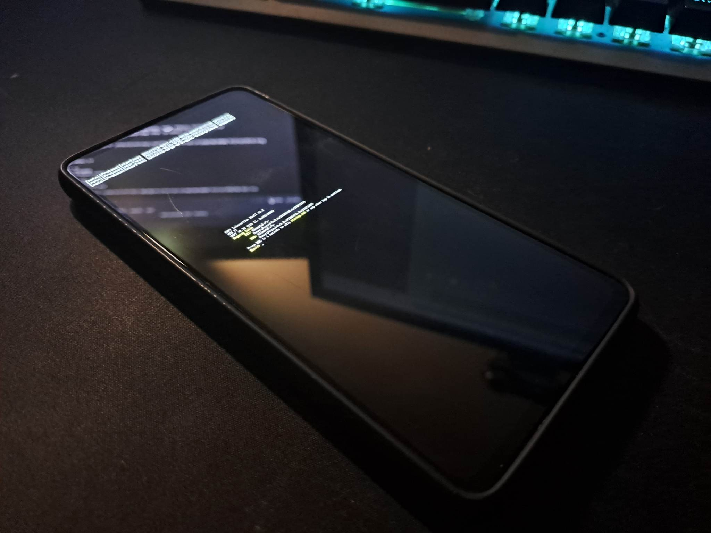

# EDK2 UEFI firmware for Samsung Galaxy A52s 5G

## Working

Display

Boots to EFI shell



## Not Working

UFS

SDcard

USB

ACPI

etc...


For 4G and 8G RAM models you might need to change some values

## Building

Tested on:

Ubuntu 22.04.1 LTS (x86)


Setup
```
git clone https://github.com/arminask/edk2-SMA528B
git clone https://github.com/tianocore/edk2.git --recursive --depth 1
sudo apt install build-essential uuid-dev iasl git nasm python3-distutils gcc-aarch64-linux-gnu abootimg
cd edk2-SMA528B
chmod +x firstrun.sh
./firstrun.sh
```
Build
```
chmod +x build_debug.sh
./build_debug.sh
```
Flash with heimdall
```
heimdall flash --BOOT boot-SMA528B_debug.img
```

Flash with FastbootD:
```
fastboot flash boot boot-SMA528B_debug.img
```

# Credits

SoC port from Gezine [edk2-SMT733](https://github.com/Gezine/edk2-SMT733)

SimpleFbDxe screen driver is from imbushuo's [Lumia950XLPkg](https://github.com/WOA-Project/Lumia950XLPkg).

`map220v` for his original `edk2-a72q` and teaching me a lot of things

`fxsheep` for his original `edk2-sagit`

`strongtz` for maintaining Renegade Project****

